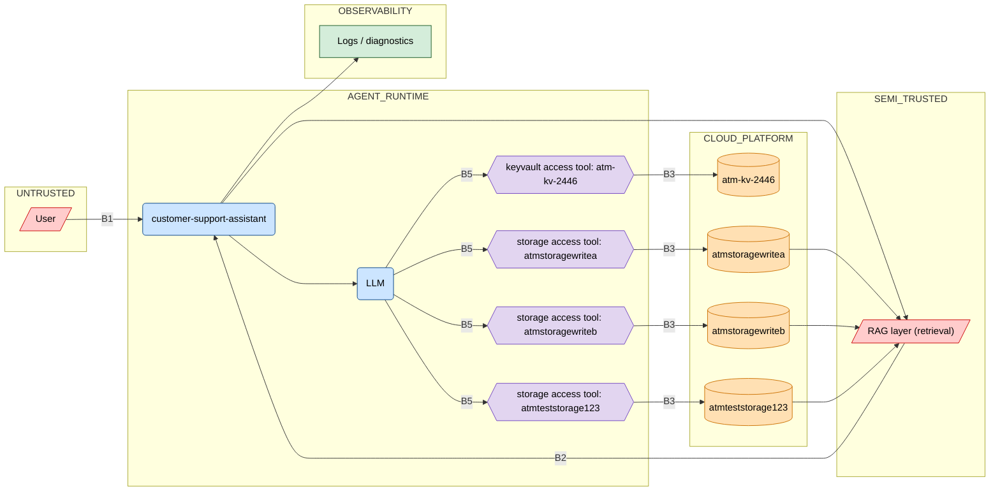

# Security Posture Report — customer-support-assistant

- **Declared autonomy**: supervised
- **Generated**: 2026-06-30

## Executive summary

This agent has 13 high-severity findings requiring immediate remediation.

| Severity | Count |
|----------|-------|
| 🔴 CRITICAL | 1 |
| 🟠 HIGH | 12 |
| 🟡 MEDIUM | 4 |
| 🔵 LOW | 0 |

## Data Flow Diagram

> 6 lateral inter-resource vectors detected — see attack paths in the detailed findings.

## ⚠️ Capability mismatch — declared intent vs. real Azure permissions

The following findings show the agent's real permissions contradicting its declared business intent:

- 🔴 **[CRITICAL]** **Secret access contradicts the declared intent** — /subscriptions/cce3f0d7-5933-4838-a31e-4567cbc117d0/resourceGroups/atm-test-rg/providers/Microsoft.KeyVault/vaults/atm-kv-2446 (`ATM-KEYVAULT-004`)
- 🟠 **[HIGH]** **Storage write contradicts the declared intent** — /subscriptions/cce3f0d7-5933-4838-a31e-4567cbc117d0/resourceGroups/atm-test-rg/providers/Microsoft.Storage/storageAccounts/atmteststorage123 (`ATM-STORAGE-004`)
- 🟠 **[HIGH]** **Storage write contradicts the declared intent** — /subscriptions/cce3f0d7-5933-4838-a31e-4567cbc117d0/resourceGroups/atm-test-rg/providers/Microsoft.Storage/storageAccounts/atmstoragewriteb (`ATM-STORAGE-004`)
- 🟠 **[HIGH]** **Storage write contradicts the declared intent** — /subscriptions/cce3f0d7-5933-4838-a31e-4567cbc117d0/resourceGroups/atm-test-rg/providers/Microsoft.Storage/storageAccounts/atmstoragewritea (`ATM-STORAGE-004`)

## Detailed findings

### 🔴 **[CRITICAL]** Secret access contradicts the declared intent

- **Rule**: `ATM-KEYVAULT-004` · **Category**: Key Vault
- **Affected resource(s)**: /subscriptions/cce3f0d7-5933-4838-a31e-4567cbc117d0/resourceGroups/atm-test-rg/providers/Microsoft.KeyVault/vaults/atm-kv-2446
- **OWASP**: LLM06: Excessive Agency

The agent can read secret values from Key Vault 'atm-kv-2446' via Key Vault Secrets User (can_read_data=True), while its business role forbids secret access.

**Mitigation**: Remove the secret-read role on 'atm-kv-2446': `az role assignment delete --assignee <principalId> --scope /subscriptions/cce3f0d7-5933-4838-a31e-4567cbc117d0/resourceGroups/atm-test-rg/providers/Microsoft.KeyVault/vaults/atm-kv-2446`.

### 🟠 **[HIGH]** Key Vault without network restriction

- **Rule**: `ATM-KEYVAULT-001` · **Category**: Key Vault
- **Affected resource(s)**: /subscriptions/cce3f0d7-5933-4838-a31e-4567cbc117d0/resourceGroups/atm-test-rg/providers/Microsoft.KeyVault/vaults/atm-kv-2446
- **OWASP**: LLM08: Vector and Embedding Weaknesses

Key Vault 'atm-kv-2446' has network_acls_default_action='Allow' (firewall open to all networks) and is accessible by the agent via Key Vault Secrets User.

**Mitigation**: Close the default firewall then allow only the required networks: `az keyvault update --name atm-kv-2446 --default-action Deny`.

### 🟠 **[HIGH]** Writable, network-exposed storage (RAG poisoning vector)

- **Rule**: `ATM-STORAGE-001` · **Category**: Storage
- **Affected resource(s)**: /subscriptions/cce3f0d7-5933-4838-a31e-4567cbc117d0/resourceGroups/atm-test-rg/providers/Microsoft.Storage/storageAccounts/atmteststorage123
- **OWASP**: LLM08: Vector and Embedding Weaknesses

Storage account 'atmteststorage123' has network_acls_default_action='Allow' and is writable via Storage Blob Data Contributor: an attacker can drop poisoned documents that are then ingested by the RAG pipeline.

**Mitigation**: Close the default firewall: `az storage account update --name atmteststorage123 --default-action Deny`, then allow only the necessary networks.

### 🟠 **[HIGH]** Writable, network-exposed storage (RAG poisoning vector)

- **Rule**: `ATM-STORAGE-001` · **Category**: Storage
- **Affected resource(s)**: /subscriptions/cce3f0d7-5933-4838-a31e-4567cbc117d0/resourceGroups/atm-test-rg/providers/Microsoft.Storage/storageAccounts/atmstoragewriteb
- **OWASP**: LLM08: Vector and Embedding Weaknesses

Storage account 'atmstoragewriteb' has network_acls_default_action='Allow' and is writable via Storage Blob Data Contributor: an attacker can drop poisoned documents that are then ingested by the RAG pipeline.

**Mitigation**: Close the default firewall: `az storage account update --name atmstoragewriteb --default-action Deny`, then allow only the necessary networks.

### 🟠 **[HIGH]** Writable, network-exposed storage (RAG poisoning vector)

- **Rule**: `ATM-STORAGE-001` · **Category**: Storage
- **Affected resource(s)**: /subscriptions/cce3f0d7-5933-4838-a31e-4567cbc117d0/resourceGroups/atm-test-rg/providers/Microsoft.Storage/storageAccounts/atmstoragewritea
- **OWASP**: LLM08: Vector and Embedding Weaknesses

Storage account 'atmstoragewritea' has network_acls_default_action='Allow' and is writable via Storage Blob Data Contributor: an attacker can drop poisoned documents that are then ingested by the RAG pipeline.

**Mitigation**: Close the default firewall: `az storage account update --name atmstoragewritea --default-action Deny`, then allow only the necessary networks.

### 🟠 **[HIGH]** Storage write contradicts the declared intent

- **Rule**: `ATM-STORAGE-004` · **Category**: Storage
- **Affected resource(s)**: /subscriptions/cce3f0d7-5933-4838-a31e-4567cbc117d0/resourceGroups/atm-test-rg/providers/Microsoft.Storage/storageAccounts/atmteststorage123
- **OWASP**: LLM08: Vector and Embedding Weaknesses

The agent can write to Storage 'atmteststorage123' via Storage Blob Data Contributor (can_write_data=True), while its business role forbids writing/modifying — a document-corpus poisoning vector.

**Mitigation**: Replace the write role with 'Storage Blob Data Reader' on 'atmteststorage123': `az role assignment delete --assignee <principalId> --scope /subscriptions/cce3f0d7-5933-4838-a31e-4567cbc117d0/resourceGroups/atm-test-rg/providers/Microsoft.Storage/storageAccounts/atmteststorage123`.

### 🟠 **[HIGH]** Storage write contradicts the declared intent

- **Rule**: `ATM-STORAGE-004` · **Category**: Storage
- **Affected resource(s)**: /subscriptions/cce3f0d7-5933-4838-a31e-4567cbc117d0/resourceGroups/atm-test-rg/providers/Microsoft.Storage/storageAccounts/atmstoragewriteb
- **OWASP**: LLM08: Vector and Embedding Weaknesses

The agent can write to Storage 'atmstoragewriteb' via Storage Blob Data Contributor (can_write_data=True), while its business role forbids writing/modifying — a document-corpus poisoning vector.

**Mitigation**: Replace the write role with 'Storage Blob Data Reader' on 'atmstoragewriteb': `az role assignment delete --assignee <principalId> --scope /subscriptions/cce3f0d7-5933-4838-a31e-4567cbc117d0/resourceGroups/atm-test-rg/providers/Microsoft.Storage/storageAccounts/atmstoragewriteb`.

### 🟠 **[HIGH]** Storage write contradicts the declared intent

- **Rule**: `ATM-STORAGE-004` · **Category**: Storage
- **Affected resource(s)**: /subscriptions/cce3f0d7-5933-4838-a31e-4567cbc117d0/resourceGroups/atm-test-rg/providers/Microsoft.Storage/storageAccounts/atmstoragewritea
- **OWASP**: LLM08: Vector and Embedding Weaknesses

The agent can write to Storage 'atmstoragewritea' via Storage Blob Data Contributor (can_write_data=True), while its business role forbids writing/modifying — a document-corpus poisoning vector.

**Mitigation**: Replace the write role with 'Storage Blob Data Reader' on 'atmstoragewritea': `az role assignment delete --assignee <principalId> --scope /subscriptions/cce3f0d7-5933-4838-a31e-4567cbc117d0/resourceGroups/atm-test-rg/providers/Microsoft.Storage/storageAccounts/atmstoragewritea`.

### 🟠 **[HIGH]** Accessible resource without traceability (diagnostic settings absent)

- **Rule**: `ATM-LOGGING-001` · **Category**: Observability
- **Affected resource(s)**: /subscriptions/cce3f0d7-5933-4838-a31e-4567cbc117d0/resourceGroups/atm-test-rg/providers/Microsoft.KeyVault/vaults/atm-kv-2446
- **OWASP**: LLM09: Misinformation

The resource 'atm-kv-2446' (keyvault), accessible by the agent via Key Vault Secrets User, has no active diagnostic setting: a compromise or an abnormal access would leave no usable trace.

**Mitigation**: Enable diagnostic settings to a Log Analytics workspace: `az monitor diagnostic-settings create --name atm-diag --resource /subscriptions/cce3f0d7-5933-4838-a31e-4567cbc117d0/resourceGroups/atm-test-rg/providers/Microsoft.KeyVault/vaults/atm-kv-2446 --workspace <workspaceId> --logs '[{"categoryGroup":"audit","enabled":true}]'`.

### 🟠 **[HIGH]** Prompt injection path to a Key Vault

- **Rule**: `ATM-LLM-001` · **Category**: LLM attack path
- **Affected resource(s)**: /subscriptions/cce3f0d7-5933-4838-a31e-4567cbc117d0/resourceGroups/atm-test-rg/providers/Microsoft.KeyVault/vaults/atm-kv-2446
- **OWASP**: LLM01: Prompt Injection

An untrusted user prompt can influence the LLM (boundary B5) up to triggering access to Key Vault 'atm-kv-2446': user → agent → llm → tool → 'atm-kv-2446'. This is a prompt-injection impact path toward secrets.

**Mitigation**: Insert a human-in-the-loop validation on the tools touching 'atm-kv-2446', or remove Key Vault access from the LLM's tool scope.

**Attack path(s):**

- `user → agent → llm → tool:keyvault:atm-kv-2446 → resource:keyvault:atm-kv-2446  (boundaries: B1, B5, B3)`

### 🟠 **[HIGH]** RAG poisoning path to a writable storage

- **Rule**: `ATM-LLM-002` · **Category**: LLM attack path
- **Affected resource(s)**: /subscriptions/cce3f0d7-5933-4838-a31e-4567cbc117d0/resourceGroups/atm-test-rg/providers/Microsoft.Storage/storageAccounts/atmteststorage123
- **OWASP**: LLM01: Prompt Injection

A poisoned RAG document can influence the LLM (boundary B5) up to a write into Storage 'atmteststorage123': rag → agent → llm → tool → 'atmteststorage123'. The agent would thus corrupt its own document corpus.

**Mitigation**: Separate the RAG-source storage (read-only) from the write-target storage, or validate writes to 'atmteststorage123' with a human in the loop.

**Attack path(s):**

- `rag → agent → llm → tool:storage:atmteststorage123 → resource:storage:atmteststorage123  (boundaries: B2, B5, B3)`
- `rag → agent → llm → tool:storage:atmstoragewriteb → resource:storage:atmstoragewriteb → resource:storage:atmteststorage123  (boundaries: B2, B5, B3)  [lateral: read/exfiltration or inter-storage copy possible]`
- `rag → agent → llm → tool:storage:atmstoragewriteb → resource:storage:atmstoragewriteb → resource:storage:atmteststorage123  (boundaries: B2, B5, B3)  [lateral: RAG poisoning → inter-storage write possible]`
- `rag → agent → llm → tool:storage:atmstoragewritea → resource:storage:atmstoragewritea → resource:storage:atmteststorage123  (boundaries: B2, B5, B3)  [lateral: read/exfiltration or inter-storage copy possible]`
- `rag → agent → llm → tool:storage:atmstoragewritea → resource:storage:atmstoragewritea → resource:storage:atmteststorage123  (boundaries: B2, B5, B3)  [lateral: RAG poisoning → inter-storage write possible]`

### 🟠 **[HIGH]** RAG poisoning path to a writable storage

- **Rule**: `ATM-LLM-002` · **Category**: LLM attack path
- **Affected resource(s)**: /subscriptions/cce3f0d7-5933-4838-a31e-4567cbc117d0/resourceGroups/atm-test-rg/providers/Microsoft.Storage/storageAccounts/atmstoragewriteb
- **OWASP**: LLM01: Prompt Injection

A poisoned RAG document can influence the LLM (boundary B5) up to a write into Storage 'atmstoragewriteb': rag → agent → llm → tool → 'atmstoragewriteb'. The agent would thus corrupt its own document corpus.

**Mitigation**: Separate the RAG-source storage (read-only) from the write-target storage, or validate writes to 'atmstoragewriteb' with a human in the loop.

**Attack path(s):**

- `rag → agent → llm → tool:storage:atmteststorage123 → resource:storage:atmteststorage123 → resource:storage:atmstoragewriteb  (boundaries: B2, B5, B3)  [lateral: read/exfiltration or inter-storage copy possible]`
- `rag → agent → llm → tool:storage:atmteststorage123 → resource:storage:atmteststorage123 → resource:storage:atmstoragewriteb  (boundaries: B2, B5, B3)  [lateral: RAG poisoning → inter-storage write possible]`
- `rag → agent → llm → tool:storage:atmstoragewriteb → resource:storage:atmstoragewriteb  (boundaries: B2, B5, B3)`
- `rag → agent → llm → tool:storage:atmstoragewritea → resource:storage:atmstoragewritea → resource:storage:atmstoragewriteb  (boundaries: B2, B5, B3)  [lateral: read/exfiltration or inter-storage copy possible]`
- `rag → agent → llm → tool:storage:atmstoragewritea → resource:storage:atmstoragewritea → resource:storage:atmstoragewriteb  (boundaries: B2, B5, B3)  [lateral: RAG poisoning → inter-storage write possible]`

### 🟠 **[HIGH]** RAG poisoning path to a writable storage

- **Rule**: `ATM-LLM-002` · **Category**: LLM attack path
- **Affected resource(s)**: /subscriptions/cce3f0d7-5933-4838-a31e-4567cbc117d0/resourceGroups/atm-test-rg/providers/Microsoft.Storage/storageAccounts/atmstoragewritea
- **OWASP**: LLM01: Prompt Injection

A poisoned RAG document can influence the LLM (boundary B5) up to a write into Storage 'atmstoragewritea': rag → agent → llm → tool → 'atmstoragewritea'. The agent would thus corrupt its own document corpus.

**Mitigation**: Separate the RAG-source storage (read-only) from the write-target storage, or validate writes to 'atmstoragewritea' with a human in the loop.

**Attack path(s):**

- `rag → agent → llm → tool:storage:atmteststorage123 → resource:storage:atmteststorage123 → resource:storage:atmstoragewritea  (boundaries: B2, B5, B3)  [lateral: read/exfiltration or inter-storage copy possible]`
- `rag → agent → llm → tool:storage:atmteststorage123 → resource:storage:atmteststorage123 → resource:storage:atmstoragewritea  (boundaries: B2, B5, B3)  [lateral: RAG poisoning → inter-storage write possible]`
- `rag → agent → llm → tool:storage:atmstoragewriteb → resource:storage:atmstoragewriteb → resource:storage:atmstoragewritea  (boundaries: B2, B5, B3)  [lateral: read/exfiltration or inter-storage copy possible]`
- `rag → agent → llm → tool:storage:atmstoragewriteb → resource:storage:atmstoragewriteb → resource:storage:atmstoragewritea  (boundaries: B2, B5, B3)  [lateral: RAG poisoning → inter-storage write possible]`
- `rag → agent → llm → tool:storage:atmstoragewritea → resource:storage:atmstoragewritea  (boundaries: B2, B5, B3)`

### 🟡 **[MEDIUM]** Key Vault without purge protection

- **Rule**: `ATM-KEYVAULT-002` · **Category**: Key Vault
- **Affected resource(s)**: /subscriptions/cce3f0d7-5933-4838-a31e-4567cbc117d0/resourceGroups/atm-test-rg/providers/Microsoft.KeyVault/vaults/atm-kv-2446

Key Vault 'atm-kv-2446' has purge_protection_enabled=False: a deleted secret can be permanently purged before the end of the retention period.

**Mitigation**: Enable purge protection (irreversible): `az keyvault update --name atm-kv-2446 --enable-purge-protection true`.

### 🟡 **[MEDIUM]** Accessible resource without traceability (diagnostic settings absent)

- **Rule**: `ATM-LOGGING-001` · **Category**: Observability
- **Affected resource(s)**: /subscriptions/cce3f0d7-5933-4838-a31e-4567cbc117d0/resourceGroups/atm-test-rg/providers/Microsoft.Storage/storageAccounts/atmteststorage123
- **OWASP**: LLM09: Misinformation

The resource 'atmteststorage123' (storage), accessible by the agent via Storage Blob Data Contributor, has no active diagnostic setting: a compromise or an abnormal access would leave no usable trace.

**Mitigation**: Enable diagnostic settings to a Log Analytics workspace: `az monitor diagnostic-settings create --name atm-diag --resource /subscriptions/cce3f0d7-5933-4838-a31e-4567cbc117d0/resourceGroups/atm-test-rg/providers/Microsoft.Storage/storageAccounts/atmteststorage123 --workspace <workspaceId> --logs '[{"categoryGroup":"audit","enabled":true}]'`.

### 🟡 **[MEDIUM]** Accessible resource without traceability (diagnostic settings absent)

- **Rule**: `ATM-LOGGING-001` · **Category**: Observability
- **Affected resource(s)**: /subscriptions/cce3f0d7-5933-4838-a31e-4567cbc117d0/resourceGroups/atm-test-rg/providers/Microsoft.Storage/storageAccounts/atmstoragewriteb
- **OWASP**: LLM09: Misinformation

The resource 'atmstoragewriteb' (storage), accessible by the agent via Storage Blob Data Contributor, has no active diagnostic setting: a compromise or an abnormal access would leave no usable trace.

**Mitigation**: Enable diagnostic settings to a Log Analytics workspace: `az monitor diagnostic-settings create --name atm-diag --resource /subscriptions/cce3f0d7-5933-4838-a31e-4567cbc117d0/resourceGroups/atm-test-rg/providers/Microsoft.Storage/storageAccounts/atmstoragewriteb --workspace <workspaceId> --logs '[{"categoryGroup":"audit","enabled":true}]'`.

### 🟡 **[MEDIUM]** Accessible resource without traceability (diagnostic settings absent)

- **Rule**: `ATM-LOGGING-001` · **Category**: Observability
- **Affected resource(s)**: /subscriptions/cce3f0d7-5933-4838-a31e-4567cbc117d0/resourceGroups/atm-test-rg/providers/Microsoft.Storage/storageAccounts/atmstoragewritea
- **OWASP**: LLM09: Misinformation

The resource 'atmstoragewritea' (storage), accessible by the agent via Storage Blob Data Contributor, has no active diagnostic setting: a compromise or an abnormal access would leave no usable trace.

**Mitigation**: Enable diagnostic settings to a Log Analytics workspace: `az monitor diagnostic-settings create --name atm-diag --resource /subscriptions/cce3f0d7-5933-4838-a31e-4567cbc117d0/resourceGroups/atm-test-rg/providers/Microsoft.Storage/storageAccounts/atmstoragewritea --workspace <workspaceId> --logs '[{"categoryGroup":"audit","enabled":true}]'`.

## Methodology

This report compares the agent's declared business intent against the real Azure IAM permissions of its managed identity, surfacing capability mismatches and concrete attack paths. The analysis is fully deterministic: findings are produced by a static rules engine over the threat-model graph — no LLM, no network calls, no API keys.

Trust boundaries in the model:

- **B1** — User → Agent: Untrusted user input entering the agent runtime (prompt injection).
- **B2** — RAG content → Agent: Potentially poisoned retrieved content entering the agent's context (RAG poisoning).
- **B3** — Agent → Azure resources: Crossing the IAM privilege boundary: the agent acts on cloud resources.
- **B4** — Azure → Logs: Emission of audit events from a resource to observability.
- **B5** — LLM decision → tool invocation: The decision to invoke a tool is made by the LLM, potentially under the influence of untrusted input (prompt injection / RAG poisoning). Agency boundary, distinct from the zone boundaries B1–B4.
